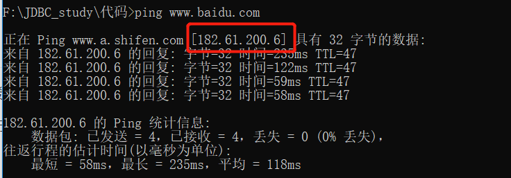
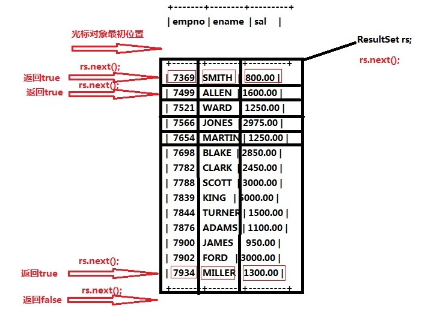
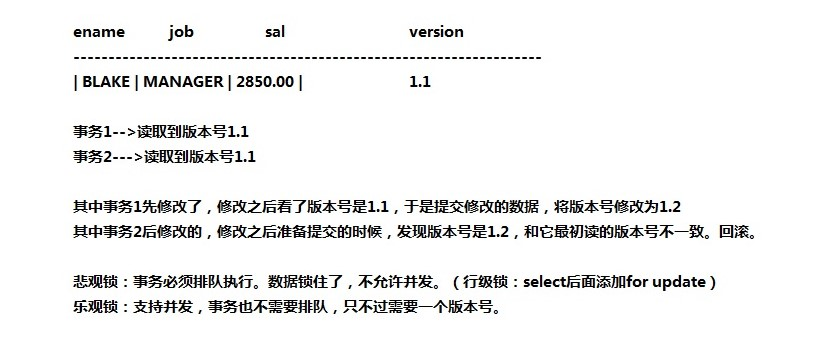

# JDBC基础知识和实现

## JDBC简介

### 基础知识

1.JDBC是什么

- Java DataBase Connectivity（Java语言连接数据库）

2.JDBC的本质是什么？

- 在java.sql.*；（这个包下有很多接口）

- JDBC是SUN公司制定的**一套接口**（interface）

- 接口都有调用者和实现者。（定义了接口需要调用者和实现者一起遵守）

- 面向接口调用、面向接口实现类，这都属于面向接口编程。

3.为什么要面向接口编程？

- 解耦合：降低程序的耦合度，提高程序的拓展力。

- 多态机制就是非常典型的：面相抽象编程。（不要面向具体编程）

```java
// 建议：父类型的引用指向子类型的对象
Animal a = new Cat()
Animal a = new Dog()
public void feed(Animal a ){   // 面向父类型编程
    
}
// 不建议
Dog d = new Dog()
Cat e = new Cat()
```

---

思考

- 为什么SUN制定JDBC接口？

  - 因为每一个数据库底层的实现原理都不一样。Oracle数据库有自己的原理、MySQL数据库有自己的原理、MS SqlServer数据库也有自己的原理。

  - 接口下的实现类有多个，但是接口只有一个。调用者和实现者都用这个接口。


- 驱动：（驱动是实现）

  - 所有数据库驱动都以jar包形式存在，jar包中有很多.calss文件，这些class文件就是对JDBC接口的**实现**。


  - 驱动不是SUN公司提供的，是各大数据库厂家负责提供，下载驱动jar包需要去数据库官网下载。

  - 注意：驱动的版本需要和数据库的版本对应。

### 环境配置

JDBC开发前的准备工作：

- 针对记事本的开发：从官网下载对应的驱动jar包，然后将其配置到环境变量classpath包中。

  注意：在记事本编译需要添加`javac -encoding UTF-8 *.java` 指明字符集，不然会报错编码

  ```shell
  # 记事本在cmd编辑编译的方法
  # 在存放java文件的文件路径栏下输入 cmd
  javac -encoding utf-8 *.java     # 编译当前目录下的所有.java文件;也可以编译指定文件
  java xxx                         # 运行；xxx是文件名,不需要.后缀
  ```

  - 针对IDEA的开发：IDEA配置jar包，相当于记事本配置环境变量。

    ​        简单来说，配置jar包的方式为：右键Module点击Open Module Settings，点击左侧边栏Libraries，点击中间左上角`+`加号，点击java，找到自己下载好的jar包并引入。

    - 新建新工程，新模块化后

    - 右键模块，点击`open module settings`→点击libararies→点击加号点击java→选中要引入的jar包→点击ok

      注意：如果后面添加了新的模块，还需要再对模块重新引入jar包。

      

      

    引入成功后，项目侧边栏显示

    

## JDBC编程六步

### JDCB编程六步（需要背会）

- 第一步：注册驱动（作用：告诉Java程序，即将要连接的是哪个品牌的数据库）

- 第二步：获取连接 （表示JVM的进程和数据库之间的通道打开了，这属于进程之间的通信，重量级的，使用完之后一定要关闭）

- 第三步：获取数据库操作对象（专门执行sql语句的对象）

- 第四步：执行SQL语句 （DDL  DML）

- 第五步：处理查询结果集 (只有当第四步执行的是select语句的时候，才需要第五步的查询结果集)

- 第六步：释放资源（使用完资源后一定要关闭资源。Java和数据库属于进程间通信，开启后一定要关闭。）

### 细节补充

#### url

**1.基础知识**

url的构成：协议+ip地址(域名)+端口号+请求的资源

- 通信协议，简称协议。

  通信协议是通信之前就规定好的**数据传送格式**。数据包具体怎么传数据，格式提前确定好。

- 域名的作用和ip的作用基本相同。

- 端口号可省略，省略则访问默认端口号80，大部分网站URL不含端口号是因为都是使用的80端口。

  Tomcat默认的访问端口是8080，可以修改为80。

  修改方法：conf文件中的server.xml，在Connector标签中port属性修改为80。

- 请求的资源可省略，省略则访问资源默认index.html

**2.举例**

ping 域名的返回信息查看ip



```shell
# 访问百度
http://182.61.200.6:80/index.html       
# http://    	通信协议
# 182.61.200.6	服务器ip地址
# 80 		    服务器上软件的度单口
# index.html 	服务器上的资源名
```

```shell
# 访问数据库 只需要找到对应库;表在sql语句中查询
jdbc:mysql://127.0.0.1:3306/bjpowernode 
# jdbc:mysql:// 通信协议
# 127.0.0.1 	IP地址
# 3306 			端口号
# bjpowernode 	具体的数据库实例名
# 说明：localhost和127.0.0.1都是本地IP地址，写哪个都行		
```

#### sql处理查询结果集

1.getString()方法获得结果集，不管数据库中列的数据类型是什么，返回的全部是字符类型。

- 括号里写列的数字下标，**从1开始**
- 括号里写列名，**这个列明写的是查询结果的列名，如果有起别名需要写别名；而不是表中的原名**
- 除了以String类型取出来，还可以取**指定类型的数据**
  - getInt()
  - getDouble()

2.循环遍历结果集，取出全部数据



如果查询到了数据，那么rs.next()为true；一直循环下去，直到rs.next()为false，表示已经读完表。

```java
// rs自己在变动不断指向下一个,因此在函数体里不用写循环变化量
while(rs.next()){
            String deptno = rs.getString("");  
            String dname = rs.getString("");
            String loc = rs.getString("");
            System.out.println(deptno+ "," +dname+ "," +loc);
        }
```

## 案例

### 需求

- 程序运行，提供入口，让用户输入用户名和密码

- 用户输入用户名和密码之后，提交信息，java收集到用户信息

- java程序连接数据库后验证用户名和密码是否合法

- 合法：显示登陆成功；不合法：显示登陆失败

在实际开发中，表的设计会使用专业的建模工具，安装一个建模工具：PowerDesigner

### 设计数据库表

使用PowerDesigner文件设计需要的数据库表，

有时候设计的数据库表过大，无法使用navicat打开；所以在命令行cmd执行相关.sql文件。

```shell
# 连接并进入指定数据库后
mysql -u root -p  # 输入后,命令行会提示输入密码
use databasename  # 将databasename修改为要处理的数据库的名字
source xxx.sql    # 执行.sql文件内的代码
```

注意：如果在命令行中文显示异常，不代表出错，原因：数据库内和命令行对文字的编码不不同，

### 查询占位符？

需求：需要根据用户的输入来执行sql查询，需要使用？占位符，接受到用户的输入后再给占位符复制。

- 给占位符赋值的方法
  - setString()，赋值给占位符后，sql语句的相应内容会被单引号包围。
  - setInt()，相应的内容不会被单引号包围。
  - setDouble()，相应的内容不会被单引号包围。

### sql注入

#### 原因

- 表现：sql注入是用户输入的用户名和密码不对但是登录成功。

- sql注入的原因：

  - 用户输入的信息含有sql语句的关键字，并且这些关键字参与了sql语句的编译过程。
- 导致sql原因被扭曲，进而达到sql注入。

#### 解决方法

使用预编译sql的PreparedStatement包代替Statment包。

代码：还是六步，但是第三步、第四步。

```java
// 需要补充代码
```

#### 比较

**1.PreparedStatement和Statement和区别**

- sql注入

- 效率PreparedStatement更高
  - PreparedStatement编译一次执行多次
  - Statement编译一次执行一次，每次传入新的值都需要编译

- PreparedStatement会在编译阶段多了类型检查

综上PreparedStatement使用较多，只有极少数情况使用Statement。

**2.什么情况使用Statement？**

业务要求进行sql语句拼接的需要使用Statement。

setString()给占位符赋值会自动添加单引号，如果是用户对内容进行排序,desc或asc是不能带符号的，这种只能使用statement进行字符串拼接。

## 行级锁




悲观锁：所有事物必须串行，排队等待执行，不接受并发。（行级锁，在sql语句中添加for update实现）

乐观锁：支持并发，不需要排队，需要一个版本号；如果事务提交时发现当前的版本号和事务刚开始时的版本号不一致，那么回滚取消操作。（当一个事务提交后版本号会发生变化。）


